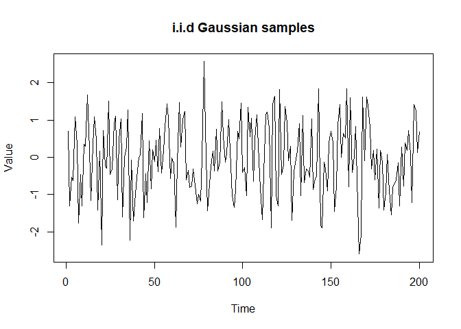
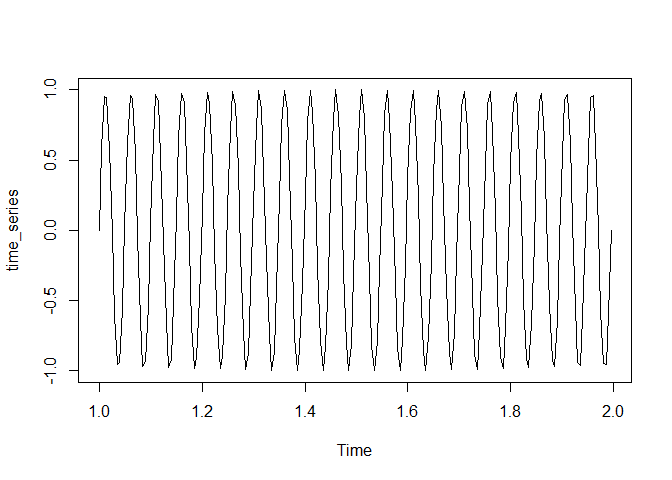
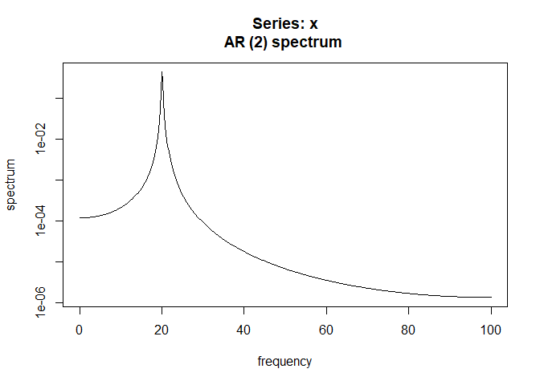

Power Spectral Density
================

The purpose of this document is to demonstrate the relationship between
spectral density, autocorrelation, and seasonality.

The `spectrum` function in R can be used to obtain the spectral density.

## Gaussian Noise

Consider a time series consisting of i.i.d Gaussian samples. Here we can
see that the spectrum is almost completely flat with a value very close
to 1.

``` r
time_series <- ts(rnorm(200),freq = 1)
plot(time_series, ylab = "Value", main = "i.i.d Gaussian samples" )
```

<!-- -->

``` r
spectrum(time_series, method = "ar")
```

<!-- -->

## Autoregressive Processes

This code generates an AR(1) process with given AR coefficient.

``` r
generate_AR_process <- function(n = 200,AR_coefficient = 0,error_sigma = 1){
  
  
stationary_distribution_sigma <- sqrt(error_sigma^2/(1-AR_coefficient^2))
  
X0 <- rnorm(1,0,stationary_distribution_sigma)
e <- rnorm(n,0,error_sigma)
time_series <- numeric(n)

time_series[1] <- X0
for(jj in 2:n){
  
  time_series[jj] <- AR_coefficient*time_series[jj-1]+e[jj]
  
}

time_series <- ts(time_series)

return(time_series)
  
}
```

### AR(1) Models

``` r
AR_coefficients <- c(0.1,0.5,0.9)
n_coefficients <- length(AR_coefficients)
par(mfrow = c(n_coefficients,2))

for(jj in 1:n_coefficients){
  
time_series <- generate_AR_process(1000,AR_coefficients[jj])
plot(time_series[1:200], main = paste("Coef = ",AR_coefficients[jj]), type = "l")
spectrum(time_series, method = "ar")
  
}
```

<!-- -->

``` r
time_series_01 <- time_series <- generate_AR_process(1000,0.1)

##

AR_coefficients <- c(-0.1,-0.5,-0.9)
n_coefficients <- length(AR_coefficients)
par(mfrow = c(n_coefficients,2))

for(jj in 1:n_coefficients){
  
time_series <- generate_AR_process(1000,AR_coefficients[jj])
plot(time_series[1:200], main = paste("Coef = ",AR_coefficients[jj]), type = "l")
spectrum(time_series, method = "ar")
  
}
```

<!-- -->

``` r
time_series_01 <- time_series <- generate_AR_process(1000,0.1)
```

### Models with Seasonality

Here frequency is defined as $1/period$. If our time series is equally
spaced observations on \[0,1\], then that would mean a period of 1/2
corresponds to a frequency of 2. When we specify the frequency, we see a
spike exactly at the frequency.

``` r
seasonal_time_series <- function(n = 200,frequency = 1,error_sd_to_amplitude_ratio = 0){
  
n_periods <- 1/frequency
period_length <- n/n_periods

t <- seq(0,2*pi,length = 200)
time_series <- sin(frequency*t)
e <- rnorm(n,0,error_sd_to_amplitude_ratio)
time_series <- time_series+e

time_series <- ts(time_series, frequency = n)

return(time_series)
  
  
}

time_series <- seasonal_time_series(frequency = 20)
plot(time_series)
```

<!-- -->

``` r
spectrum(time_series, method = "ar")
```

<!-- -->
